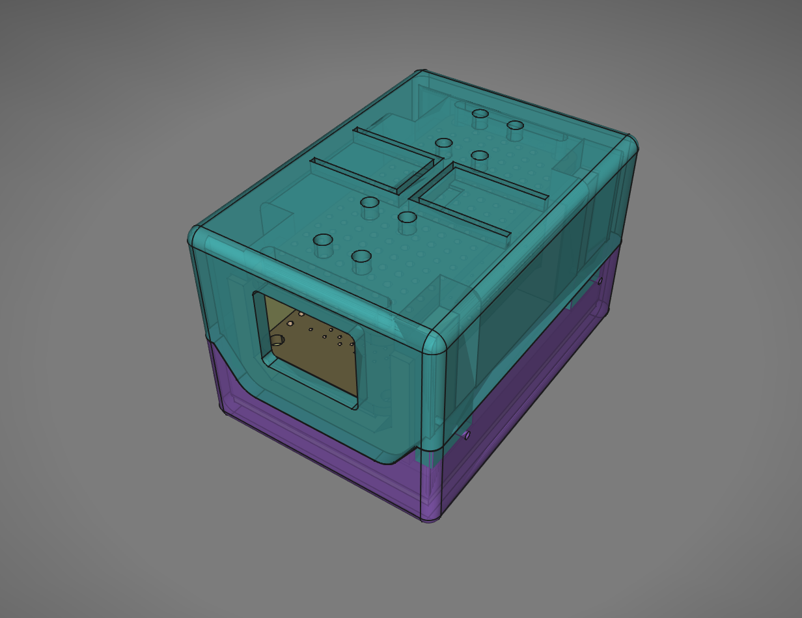

#  Enclosure for Bosh BME688 development kit

## Introduction

Bosh doesn't provide the enclosure for the BME688 development kit. CAD design with dimensions and 3D model are also not available. I think the enclosure is a requirement if you need to sample the air or gases on the move. I designed and built this enclosure because I needed to sample during extended time in different environments where USB power is not available.

#### About ElFaro LAB:
I am running a company in Europe hopefully for great projects, I am always up for challenges. I have 30+ years of experience in electronic circuits designs, I worked in a broad range of projects cases such as: space satellite avionics design, automotive circuits, robotics, a ton of IoT designs, environment sensors, efficient RF devices and embedded Linux systems.
If you need any help please contact us, we also do advisory on design trends, manufacturability and project reviews. Please find us at: [ElFaro LAB website](https://www.elfarolab.com) or [Email us](mailto:contact@elfarolab.com). Thank you.

Sometime I do also 3D CAD design, specially when a custom enclosure needs to be built.

I hope you will find these 3D models useful. Enjoy.

#### 3D models features:

This enclosure was designed with FreeCAD 0.21.2.

* top buttons with nice and pleasant click
* holes for the sensors array
* windows for USB connector and SDcard
* easy to print with almost no support required
* walls thickness is 2mm, enough strong printed in PLA
* compact and sturdy

#### Parts:
Tot. 4 parts ("bodies" in Freecad terms):
* Top lead shell for BME688 dev kit boards stack
* Bottom shell for the battery and slide switch
* 2 retainers for keep firmly in place the dev kit
 

## Battery

The battery is a Li-Ion 1000mAh 3.7V
dimensions are: 50 x 34 x 6 mm
connector compatible with Adafruit Huzzah32 type: JST 2 pins female

## Lateral slide switch

There is no power switch on Adafruit Huzzah32 and if you are sampling on the move this should be available. I used a slide switch scavenged from another circuit. I mounted this switch in such a way to cut the positive wire coming from the battery so it will not recharge the internal battery if turned off. Also it doesn't affect the power supply if connected via USB. Connected the same way as me, the switch will totally disconnect the internal battery when off.

I found this setup the most straight. You can also sample connected to USB power cable or using an external USB battery pack. Or sometime, you don't want to keep the internal battery physically connected all the time.

The switch is GS-115-0511 by CW Ind.

This could be find on Digikey here: [link](https://www.digikey.com/en/products/detail/cw-industries/GS-115-0511/1012)

## Assembly

The battery should fit inside the bottom shell. You could use 2-sides adhesive tape to keep the battery in place.

Solder the slide switch cutting the positive wire coming from the battery before its JST female connector. This way you will create a switched bridge in the positive wire.

Use the 2 retainers, front and back, to keep the kit in position and to avoid it touching the battery then close the 2 shells using 4 screws.

You will need some screws:

* 4 screws for the assembly type: M1.5 x 8mm Phillips Pan Head Sheet Metal Self Tapping
* 2 screws for the slide switch type: M1.5 x 5mm Phillips Pan Head Sheet Metal Screws Self Tapping 

Screws dimensions and type could be changed.
 

## 3D printer settings

Please adjust the following settings to make them work in your case, they should be tuned for your specific 3D printer model and material.

I included a minimal testing STEP model of the base with only the PCB board supports.
You can print this model first to check printer settings, tolerances, strength and quality without wasting further material, money and time in printing attempts. It should ready printed within 30 minutes.

It is not required but if you need it, add support material for USB cable connector and SD card windows.
The support doesn’t need to touch the building plate nor the inside of the model.
The holes for screws are printed without support at all.

I also used a tiny bit of hair spray onto the glass bed.

* slicer: Slicer Orca Slicer 2.1.1
* printer: Artillery X2 - extruder 0.4mm
* material: PLA
* temp: 212C
* bed: 50C
* sparse infill density: 35%
* first layer height: 0.26mm
* layers height: 0.2
* line width: 0.4mm
* wall loops: 5
* top shell layers: 5
* bottom shell layers: 5
* no required support for screw holes
* first layer speed: 35mm/s
* outer walls speed: 40mm/s
* inner wall speed: 55mm/s

## No responsibility disclaimer

Please use the data, files and information from this page at your own risk and responsability.
Review all the files and information before taking action building and using them into derivative products.

ElFaro LAB will be not considered responsible for errors, defects, injuries, lost of money during manufacture process of derivative products.

We provide these files and informations completely free in the spirit of the opensource for to help community to achieve their pursuit.

## License

MIT license.
